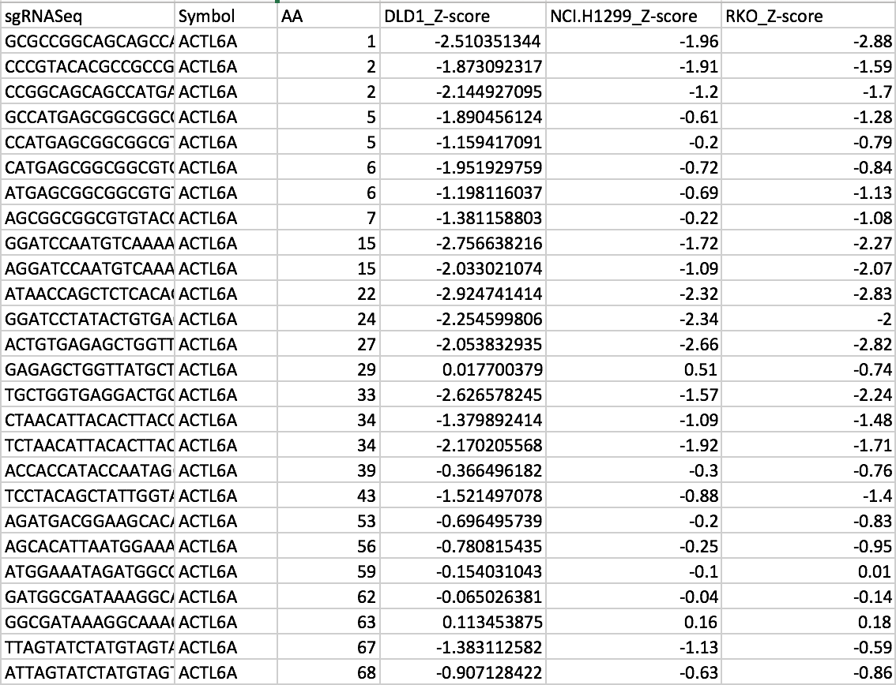
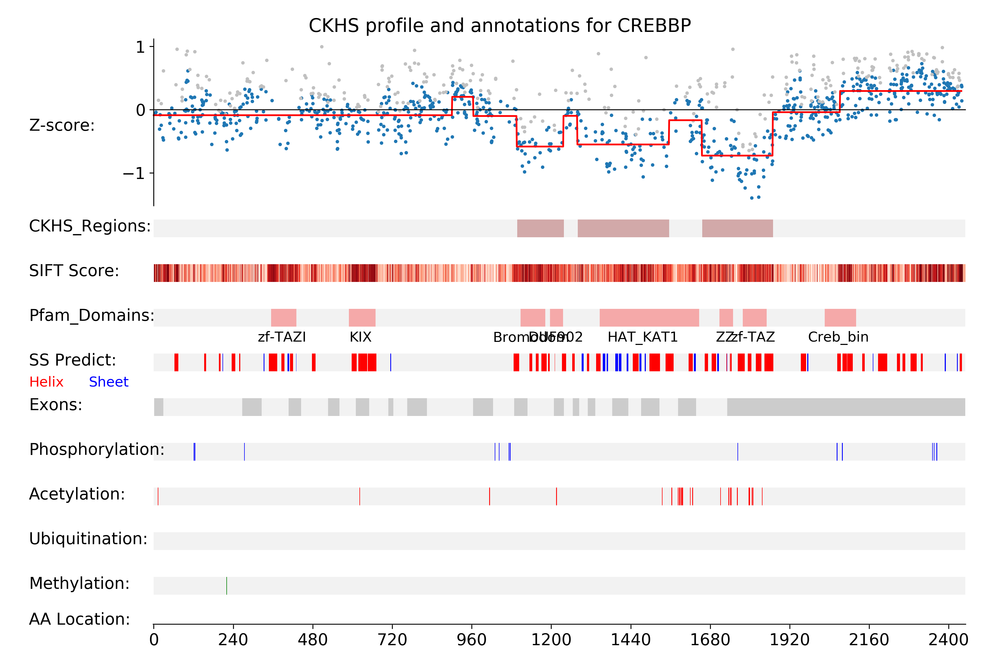

[](https://pypi.org/project/protiler/)
[](https://github.com/MDhewei/ProTiler-1.0.0/blob/master/LISENCE.txt)

[](https://doi.org/10.1038/s41467-019-12489-8)

Copyright (C) 2019, MD Anderson Cancer Center (whe3@mdanderson.org)


# ProTiler

ProTiler is a novel computational method for fine-mapping of protein regions that are hyper-sensitive to CRISPR/Cas9 mediated gene knockouts from high-throughput tiling-sgRNA functional screens. 

Also, ProTiler is able to predict HS regions for protein encoded by any given gene from other common protein features including conservation, domain annotation, secondary structures and PTMs distribution.

If you use ProTiler please cite the following paper we published on Nature Communications:

He et al. De novo identification of essential protein domains from CRISPR-Cas9 tiling-sgRNA knockout screens. **Nat Commun 10**, 4547(2019).


## Recent Changes for ProTiler

1) New version 1.0.2 is now compatible to python3.

2) The package has been uploaded to PyPI. Users now can install directly through:
```console
   pip install protiler
```


## Installation

ProTiler is written in Python and R, Python>=2.7 and R>=3.5.0 is needed
## Note: Since some large files are uploaded using git lfs, make sure git lfs is installed before downloading

### Dependencies
> **Python Packages**:
- matplotlib, pandas, numpy, seaborn

> **R packages**:
- breakfast,  stringr

### Step1: Install Anaconda (highly recomended)
```console
wget https://repo.continuum.io/archive/Anaconda2-2018.12-Linux-x86_64.sh 
bash Anaconda2-2018.12-Linux-x86_64.sh 
```

### Step2: Install required packages

> **Install Python Packages with pip**:
```console
pip install matplotlib==2.2.3 pandas sklearn numpy seaborn
```
> **Install R packages in R IDE**:
```r
install.packages('breakfast')
install.packages('stringr')
```

### Step3: Install ProTiler 
#### Note: Since some large files are uploaded using git lfs, make sure git lfs is installed before downloading

```console
git clone https://github.com/MDhewei/ProTiler-1.0.0.git
cd ProTiler-1.0.0
python setup.py install
```


## Usage 

## ProTiler has two major functions: 

## 1. Call: Call and visualize HS regions from CRISPR tiling screen data.


### Protiler call take table file(.cvs or .txt) recording CRISPR tiling screen data as input.An example is shown as below: 



### Three colums are required:

- Symbol: This column record the symbol of target gene, for example: 'CREBBP','ACTL6A' 

- AA:  The cutting loci of the corresponding sgRNA at amino acid level

- CRISPR score: the signals for each sgRNA, in the example file, z-scores in three different cell lines are used. User should select at least one column.


###  Arguments of the program:

#### Required arguments:

- -i/--inputfile: 
     
     the file path to the input table recording tiling CRISPR sgRNA annotations and signals. .csv,.txt,.xlsx format are supported 
 
 
- -g/--gene_id: 

     the official symbol of target gene, for example: 'CREBBP','ACTL6A'
 
 
- -s/--score_columns: 

     the column number(s) of input table that recording CRISPR knowckout scores
 
#### Optional arguments:

- -o/--outputdir: 

     the directory name created in the current working directory to save output files, default='ProTilerOutput'
     
- -f/--half_size: 

     The number of neiboring signals from each side selected to filter inefficient sgRNAs',default='5'

- -t1/--threshold: 

     Threshold to supress the outliers among the signals',default='2'

- -t2/--threshold2: 

     Threshold to detect changing points using TGUH method',default='1.5'


### Example to run protiler call

```console
protiler call -i sample.txt -g CREBBP -s 9,10,11 -o ProtilerOutput
```

### Output

#### 1. SegmentFile: A table record all the HS regions called by ProTiler for certain gene.


- AA.start: the start residue position of the segments called with TGUH
- AA.end: the end residue position of the segments called with TGUH
- n: the number of sgRNAs targeting the region
- m: the mean score of sgRNAs targeting the region
- is.HS.site: to judge whether the segment is a hyper-sensitive region
- length: the length of the segment
- Gene: the symbol of the target gene

#### 2. Figure4Visualization: Figure presenting signals, HS regions and other protein annotations. For example:




## 2. Predict: Predict and visualize HS regions from common protein features.

###  Arguments of the program:

#### Required arguments:

- -l/--gene_list: 
     
     A list of candidate genes for which you want to predict HS regions. eg: CREBBP,FAM122A,AURKB
 
#### Optional arguments:

- -b1/--bandwidth1:

     Bandwidth for PTMs kernel density estimation training
 
 
- -b2/--bandwidth2:

     Bandwidth for SIFT score kernel density estimation training
 
 
- -o/--outputdir: 

     the directory name created to save output files
     
- -m/--gamma: 

     The gamma parameter for SVM model,default='10'


- -c/--penalty: 

     The penalty parameter for SVM model,default='0.01'


### Example to run protiler predict

```console
protiler predict -l CREBBP,FAM122A,SAMRCB1,AURKB -o ProtilerOutput
```

### Output

#### 1. PredictionTable: A table record all the features of target protein and SVM score/class at each residue postion.


#### 2. Figure4Visualization: Figure presenting predicted  HS regions and other protein annotations. For example:


