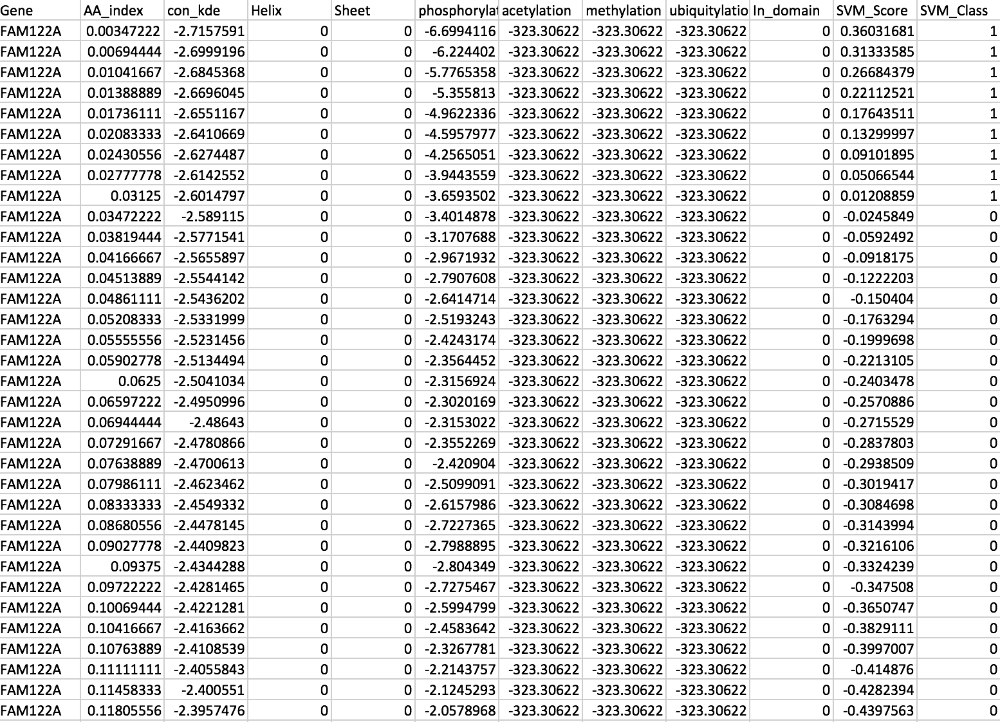
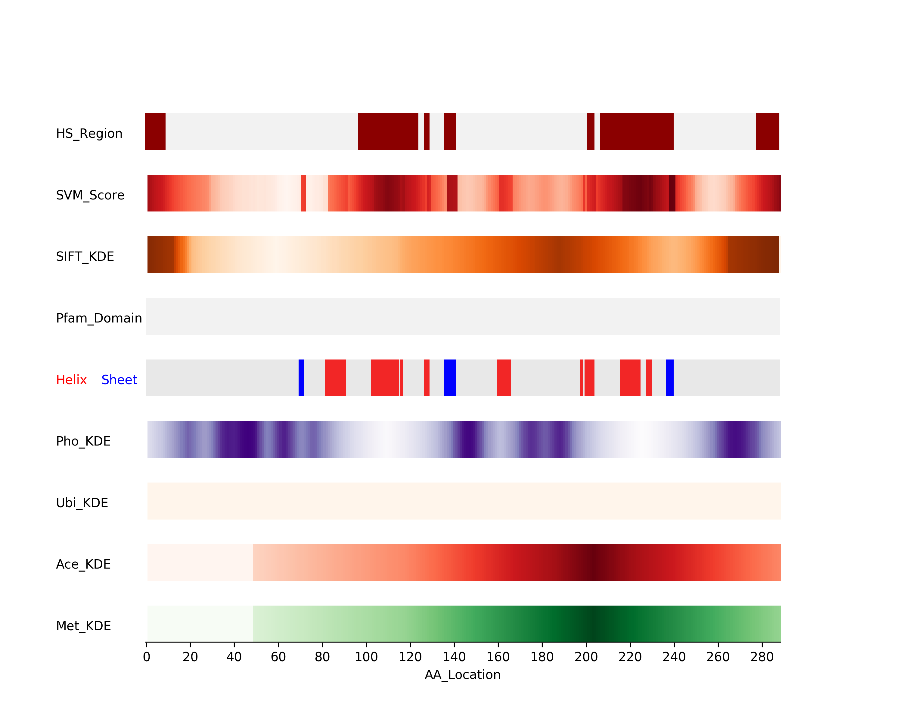

Copyright (C) 2019, Wei He (hwkobe.1027@gmail.com)


# ProTiler

ProTiler is a novel computational method for fine-mapping of protein regions that are hyper-sensitive to CRISPR/Cas9 mediated gene knockouts from high-throughput tiling-sgRNA functional screens. 

Also, ProTiler is able to predict HS regions for protein encoded by any given gene from other common protein features including conservation, domain annotation, secondary structures and PTMs distribution.


## Installation

ProTiler is written in Python and R, Python2.7 and R3.5.0 is needed

### Dependencies
> **Python Packages**:
- matplotlib
- pandas
- numpy
- seaborn

> **R packages**:
- breakfast
- stringr

### Step1: Install Anaconda (highly recomended)
```console
wget https://repo.continuum.io/archive/Anaconda2-2018.12-Linux-x86_64.sh 
bash Anaconda2-2018.12-Linux-x86_64.sh 
```

### Step2: Install required packages

> **Install Python Packages with pip**:
```console
pip install matplotlib==2.2.3 pandas sklearn numpy seaborn
```
> **Install R packages in R IDE**:
```r
install.packages('breakfast')
install.packages('stringr')
```

### Step3: Install ProTiler 

```console
git clone https://github.com/MDhewei/ProTiler-1.0.0.git
cd ProTiler
python setup.py install
```


## Usage 

## ProTiler has two major functions: 

## 1. Call: Call and visualize HS regions from CRISPR tiling screen data.


### Protiler call take table file(.cvs or .txt) recording CRISPR tiling screen data as input. An example is shown as below:


### Three colums are required:

- Symbol: This column record the symbol of target gene, for example: 'CREBBP','ACTL6A'

- AA: the amino acid position which certain sgRNAs cutting

- CRISPR score: the signals for each sgRNA, in the example file, z-scores in three different cell lines are used. User should select at least one column.


###  Arguments of the program:

#### Required arguments:

- -i/--inputfile: 
     
     the file path to the input table 
 
 
- -g/--gene_id: 

     the symmbol of target gene, for example: 'CREBBP','ACTL6A'
 
 
- -s/--score_columns: 

     the column number(s) of CRISPR scores
 
#### Optional arguments:

- -o/--outputdir: 

     the directory to save output files
     
- -f/--half_size: 

     The number of neiboring signals from each side selected to filter inefficient sgRNAs',default='5'


- -t1/--threshold: 

     Threshold to supress the filtered signals',default='2'


- -t2/--threshold2: 

     Threshold to detect changing points using TGUH method',default='1.5'


### Example to run protiler call

```console
protiler call -i Novartis.trimmed.new.txt -g CREBBP -s 9,10,11 -o ProtilerOutput
```

### Output

#### 1. SegmentFile: A table record all the HS regions called by ProTiler for certain gene.


#### 2. Figure4Visualization: Figure presenting signals, HS regions and other protein annotations. For example:


## 2. Predict: Predict and visualize HS regions from common protein features.

###  Arguments of the program:

#### Required arguments:

- -l/--gene_list: 
     
     A list of candidate genes you wish to predict HS regions. eg: CREBBP,FAM122A,AURKB
 
#### Optional arguments:

- -b1/--bandwidth1:

     Bandwidth for PTMs kernel density estimation training
 
 
- -b2/--bandwidth2:: 

     Bandwideth for SIFT score kernel density estimation training
 
 
- -o/--outputdir: 

     the directory to save output files
     
- -m/--gamma: 

     The gamma parameter for SVM model,default='10'


- -c/--penalty: 

     The penalty parameter for SVM model,default='0.01'


### Example to run protiler predict

```console
protiler predict -l CREBBP,FAM122A,SAMRCB1,AURKB -o ProtilerOutput
```

### Output

#### 1. PredictionTable: A table record all the features of target protein and SVM score/class at each residue postion.



#### 2. Figure4Visualization: Figure presenting predicted  HS regions and other protein annotations. For example:



